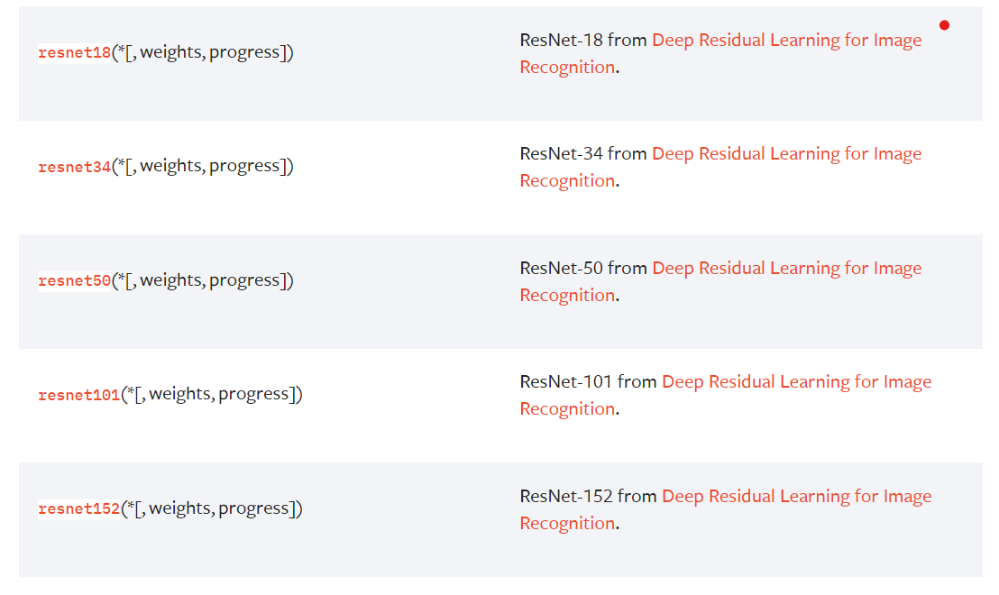
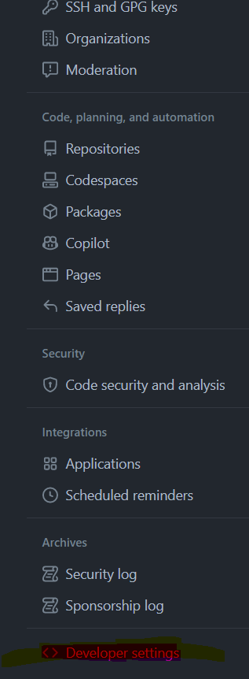

 # How to use the code for competition:
 
 1. first create the workspace  
 >$`cd ~`  
 $`mkdir IAAA_EVENT`  
 $`cd IAAA_EVENT`
 
before using github you must have signed into your 
github account in advance, for more information 
- go [here](https://docs.github.com/en/get-started/quickstart/set-up-git) 
- or the heading I created at the bottom of this page entitled: 
logging into github account with token
2. clone into the repository
> $ `git clone https://github.com/aminzakizebarjad/IAAA`

change directory into repository
> $ `cd IAAA`
3. we must download the dataset 
 do either below commands; each one that is faster
> $ `curl https://iaaa.ai/iaaa-data/iaaa-data-v3.zip -o iaaa-data-v3.zip`  
 $ `curl https://iaaa.ai/iaaa-data/iaaa-data_v2.zip -o iaaa-data_v2.zip`  

 or do equivalently:   
 >$ `wget https://iaaa.ai/iaaa-data/iaaa-data-v3.zip`  
 $ `wget https://iaaa.ai/iaaa-data/iaaa-data_v2.zip`
 
in my system **wget** was more speedy, but FYI **curl** is safer
4. do some work on files:  (if unzip is not installed then install it with apt)  
 >$ `mkdir iaaa-data-v3`  
 $ `mkdir iaaa-data-v2`  
 $ `sudo apt install unzip`  
 
 enter your UBUNTU admin password if needed
 >$ `unzip -q iaaa-data-v3.zip -d iaaa-data-v3/`    
 $ `unzip -q iaaa-data_v2.zip d iaaa-data-v2/`    
 $ `mv iaaa-data-v2/content/iaaa-data/* iaaa-data-v2/ ` 

5. create virtual environment  
> $ `sudo apt update`  

enter your ubuntu admin password if needed  
>$ `sudo apt install python3-venv`  
>$ `python3 -m venv .venv`  
>$ `source .venv/bin/activate`
 6. now we can install the python modules ( make sure your virtual environment is acvtive, like the image below)
  
> $ `pip3 install albumentations`  
> $ `pip3 install pandas`  
> $ `pip3 install seaborn`  
> $ `pip3 install pydicom`  
> $ `pip3 install tqdm`  

 7. check your gpu driver if it is installed and if it supports CUDA 11.7  
 > $  `nvidia-smi`    

    
 
 for instance the image above shows that my driver supports CUDA versions up to 12.1, in result it will support any CUDA versions below 12.1  
 now we install pytorch and torchvision  
 **if your nvidia driver supports older CUDA versions for example X.Y then change "cu117" below to "cuXY"**  
> $ `pip3 install torch torchvision --index-url https://download.pytorch.org/whl/cu117`  
8. run CreateDatasetHierachy.py, so that the two dataset files get together
> $ `python3 CreateDatasetHierachy.py`
9. change cfg of train in v8/train.py  
if you go to the directory ultralytics/yolo/v8/classify and open train.py you can see some lines as below:  
  
for changing configurations of your training procedure you can change one or more cfgs' in the train.py
*changing model to train:*  
you can set cfg.model = 'yolov8n-cls.pt' or 'yolov8s-cls.pt' or 'yolov8m-cls.pt' or 'yolov8l-cls.pt' or 'yolov8x-cls.pt'
or you can set it to either models in torchvision. you can find them [here](https://pytorch.org/vision/stable/models.html)  
you can see below overall models:  
   
click on any of them, I choose resnet my self:  
    
you can put cfg.model = 'resnet18' or 'resnet34' or 'resnet50' or 'resnet101' or 'resnet152'  
you can do this for either of torchvision overall models  
you can also change optimizer, you can set cfg.optimizer = 'Adam' or 'SGD'  
another option is to change learning rate scheduler technic, you can set cfg.cos_lr = False for linear scheduler or you can set cfg.cos_lr = True for cosines scheduler  
**hint:** if you are using any of torchvision models you must keep cfg.pretrained = True  
another thing that you must notice is that change the cfg.name where is the directory that the training results are saved,
for example if you use resnet18 and ADAM and cosine scheduler then name you directory as :
cfg.name = 'resnet18_adam_cosine'  
10. now you can start training by below command:  
> $`python3 ultralytics/yolo/v8/classify/train.py`  

after training you must have a file named best.pt in the directory: SAVE_DIR/cfg.name/weights/best.pt  
>that is it for now, below is for submitting you model in the IAAA competition dashboard, which is out of training procedure concern,
we will come back to them in the future.  
>
# submitting the model
10. change submission.py model to best.py that is trained in advance
11. run Submission.py in terminal

# logging into github account with token  
if you have been working with git command to access your repositories on github
you must have logged in to your account once.  
when you begin working with git command you must provide your account and email so
that some GUI named GCM is prompted which look like this:  
  
but if you are using a system that does not have GUI available like WSL or some server
which only provides you with terminal, then the authentication may cause you a headache.  
here I will provide you a way to overcome this issue  
there is a github CLI command named *gh* that is for managing your github account.  
for manging your account you must first get authenticated.  
*gh* also uses two ways of logging into your account, which are browser and token.  

### downloading gh on ubuntu  
> $ `sudo apt update`   
> $ `sudo apt install curl -y`  
> $ `curl -fsSL https://cli.github.com/packages/githubcli-archive-keyring.gpg | sudo dd of=/usr/share/keyrings/githubcli-archive-keyring.gpg`   
> $ `sudo chmod go+r /usr/share/keyrings/githubcli-archive-keyring.gpg`   
> $ `echo "deb [arch=$(dpkg --print-architecture) signed-by=/usr/share/keyrings/githubcli-archive-keyring.gpg] https://cli.github.com/packages stable main" | sudo tee /etc/apt/sources.list.d/github-cli.list > /dev/null`  
> $ `sudo apt update`
> $ `sudo apt install gh -y`  

### generating a token to login
now you must provide a token, for logging into github by **gh**    
- go to your account in a GUI available system like your own PC  
- click on your account image on upper right section, then choose settings:  
  
- now at left options of the page opened choose Developer settings:  
  
- now choose personal access token then choose Tokens(classic):  
  
- click on *generate new token* and then *generate new token(classic)*  
- write down a Note and check all the boxes in the page 
- at the end of the page click on
generate token.  
- copy your token and keep it for below procedure  

### logging into your account 
now in your terminal do below procedure: 
> $ `gh auth login`

a message will prompt
- with arrow keys you can choose between *GitHub.com* and *GitHub Enterprise Server*    
choose *GitHub.com*  
- the next option it gives you is that you want to choose https or ssh to access your account  
choose *HTTPS*  
- then it asks you to choose between the method of login:  
choose *Paste an authentication token*  

### making authentication available to git  
> $`gh extension install jongio/gh-setup-git-credential-helper`  
> $`gh setup-git-credential-helper`  

now you are good to go; you can run any of git commands including: 
> $ `git clone ...`  
> $ `git pull ...`  
> $ `git push ...`  

to manage you repositories.