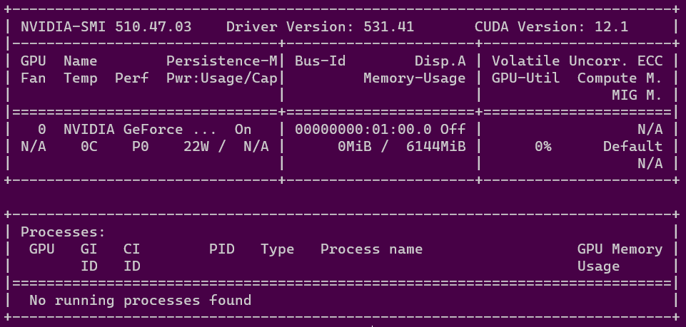

 # How to use the code for competition:
 
 1. first create the workspace  
 >$`cd ~`  
 $`mkdir IAAA_EVENT`  
 $`cd IAAA_EVENT`  
 
2. clone into the repository  (for using git command you must have signed into your github account, for more information go [here](https://docs.github.com/en/get-started/quickstart/set-up-git))
> $ `git clone https://github.com/aminzakizebarjad/IAAA`

change directory into repository
> $ `cd IAAA`
3. we must download the dataset 
 do either below commands; each one that is faster
> $ `curl https://iaaa.ai/iaaa-data/iaaa-data-v3.zip -o iaaa-data-v3.zip`  
 $ `curl https://iaaa.ai/iaaa-data/iaaa-data_v2.zip -o iaaa-data_v2.zip`  

 or do equivalently:   
 >$ `wget https://iaaa.ai/iaaa-data/iaaa-data-v3.zip`  
 $ `wget https://iaaa.ai/iaaa-data/iaaa-data_v2.zip`
 
in my system **wget** was more speedy, but FYI **curl** is safer
4. do some work on files:  (if unzip is not installed then install it with apt)  
 >$ `mkdir iaaa-data-v3`  
 $ `mkdir iaaa-data-v2`  
 $ `sudo apt install unzip`  
 
 enter your UBUNTU admin password if needed
 >$ `unzip -q iaaa-data-v3.zip -d iaaa-data-v3/`    
 $ `unzip -q iaaa-data_v2.zip d iaaa-data-v2/`    
 $ `mv iaaa-data-v2/content/iaaa-data/* iaaa-data-v2/ ` 

5. create virtual environment  
> $ `sudo apt update`  

enter your ubuntu admin password if needed  
>$ `sudo apt install python3-venv`  
>$ `python3 -m venv .venv`  
>$ `source .venv/bin/activate`
 6. now we can install the python modules ( make sure your virtual environment is acvtive, link the image below)

> $ `pip3 install albumentations`  
> $ `pip3 install pandas`  
> $ `pip3 install seaborn`  
> $ `pip3 install pydicom`  
> $ `pip3 install tqdm`  

 7. check your gpu driver if it is installed and if it supports CUDA 11.7  
 > $  `nvidia-smi`    

  
 
 for instance the image above shows that my driver supports CUDA versions up to 12.1, in result it will support any CUDA versions below 12.1  
 now we install pytorch and torchvision  
 **if your nvidia driver supports older CUDA versions for example X.Y then change "cu117" below to "cuXY"**  
> $ `pip3 install torch torchvision --index-url https://download.pytorch.org/whl/cu117`  
8. run CreateDatasetHierachy.py, so that the two dataset files get together
> $ `python3 CreateDatasetHierachy.py`
9. change cfg of train in v8/train.py  
if you go to the directory ultralytics/yolo/v8/classify and open train.py you can see come lines as below:  

for changing configurations of your training procedure you can change one or more cfgs' in the train.py
*changing model to train:*  
you can set cfg.model = 'yolov8n-cls.pt' or 'yolov8s-cls.pt' or 'yolov8m-cls.pt' or 'yolov8l-cls.pt' or 'yolov8x-cls.pt'
or you can set it to either models in torchvision. you can find them [here](https://pytorch.org/vision/stable/models.html)  
you can see below overall models:  
 
click on any of them, I choose resnet my self:  
  
you can put cfg.model = 'resnet18' or 'resnet34' or 'resnet50' or 'resnet101' or 'resnet152'  
you can do this for either of torchvision overall models  
you can also change optimizer, you can set cfg.optimizer = 'Adam' or 'SGD'  
another option is to change learning rate scheduler technic, you can set cfg.cos_lr = False for linear scheduler or you can set cfg.cos_lr = True for cosines scheduler  
**hint:** if you are using any of torchvision models you must keep cfg.pretrained = True  
another thing that you must notice is that change the cfg.name where is the directory that the training results are saved,
for example if you use resnet18 and ADAM and cosine scheduler then name you directory as :
cfg.name = 'resnet18_adam_cosine'  
10. now you can start training by below command:  
> $`python3 ultralytics/yolo/v8/trai.py`  

after training you must have a file named best.pt in the directory: IAAA/cfg.name/weights/best.pt  
>that is it for now, below is for submitting you model in the IAAA competition dashboard, which is out of training procedure concern,
we will come back to them in the future.  
10. change submission.py model to best.py that is trained in advance
11. run Submission.py in terminal